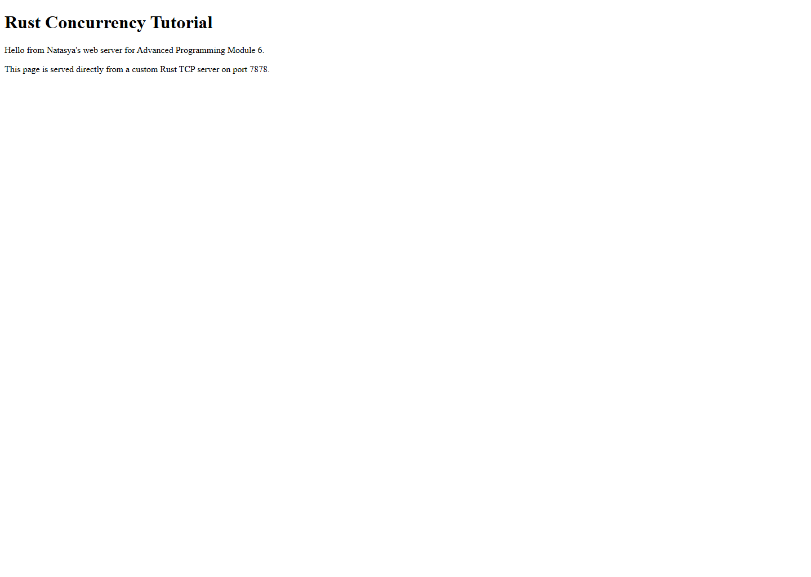

# Module 6: Concurrency Web Server

This repository contains the Advanced Programming Module 6 tutorial project that builds a simple Rust web server step by step, starting from a single-threaded TCP listener and ending with a multithreaded server backed by a thread pool.

## How to run

1. Run `cargo build` to compile the project.
2. Run `cargo run` from the repository root.
3. Open `http://127.0.0.1:7878` in a browser or send a request with a tool such as `curl`.
4. Stop the server with `Ctrl+C` before running the next milestone version.

## Commit 1 Reflection notes

In this milestone I changed the program from a trivial binary into a TCP listener that binds to `127.0.0.1:7878` and continuously accepts incoming browser connections. The `incoming()` iterator yields `Result<TcpStream, Error>` values, so the code unwraps each stream before passing the successful connection into `handle_connection`. Inside `handle_connection`, `BufReader` wraps the mutable stream reference so the program can read request data line by line instead of dealing with raw byte buffers manually. The iterator chain on `lines()` converts each incoming line into a `String`, unwraps each I/O result, stops at the first empty line, and collects the HTTP request headers into a `Vec<String>` for inspection. That stopping condition matters because an empty line marks the end of the HTTP request headers, so the server avoids waiting forever for more input when it only needs the request head. Printing the collected request makes the browser-server interaction visible and helps explain what the server will need to parse in the next milestones. This step also made the single-threaded nature of the server concrete, because every accepted connection is handled immediately in the main loop and there is no parallel work yet.

## Commit 2 Reflection notes

In the second milestone I kept the same TCP connection flow but changed the handler so it now sends a valid HTTP response instead of only printing the request. The server reads `hello.html` from disk, calculates the body length, and places that length in the `Content-Length` header so the browser knows exactly how many bytes belong to the response body. The status line `HTTP/1.1 200 OK` tells the browser that the request succeeded, and the blank line between headers and body is required by the HTTP protocol format. This milestone helped me connect Rust file I/O with network I/O, because the server first loads the HTML into memory and then writes the serialized response bytes back through the `TcpStream`. I also replaced the tutorial author's sample text with my own message so the served page clearly shows that this repository was run and customized locally. Seeing the browser render the HTML made it clear that even a very small Rust program can behave like a real web server as long as it writes a correctly structured HTTP response.

## Commit 3 Reflection notes

In this milestone I stopped returning the same page for every request and started validating the first HTTP request line. The handler now reads only the first line, matches it against the expected `GET / HTTP/1.1` pattern, and chooses both the HTTP status line and the file name in one place. That refactoring matters because the decision about which response to send is now separate from the code that serializes the final HTTP message, so the handler does not repeat the file reading, length calculation, and `write_all` logic in multiple branches. Returning a tuple of `(status_line, filename)` keeps the control flow compact while still making the response selection explicit and easy to extend. I also added a dedicated `404.html` page so invalid paths now produce a meaningful error page instead of silently returning the normal home page. This made the server feel much closer to a real web application, because the browser can now distinguish successful requests from missing resources both through the status code and through the rendered page content. The exercise also showed how even small refactorings improve readability by isolating routing decisions from low-level response formatting.

